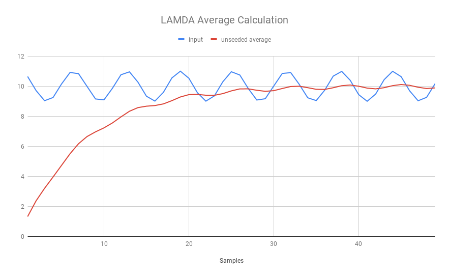

# Lamda Averager Library
## Desciption
Lamda Averager is a method to calcuate an average on a stream of data with minimal storage and no division.
## Defines
```C
#define LAMDA_SHIFT     3
```
Lamda value used for shifting in average calculation. Typically at least 3.
Higher values lead to less ripple but slower settling times.
## Types
```C
typedef fixedPoint_t lamda_average_t;
```
typdef *lamda_average_t* to whatever type of data you want to work with
## APIs
```C
lamda_average_t calcAverage(lamda_average_t prevAverage, lamda_average_t newValue);
```
## Required Libraries
fixedpoint
assert (for test)
## Tested Target
- x86
## Usage
```C
lamda_average_t someCall(void)
{
    lamda_average_t ave, input;
    while (data_available)
    {
        input = getInput();
        ave = calcAverage(ave, input);
    }
    return ave;
}
```
## Details
This average algorithm follows the calculation:
```
y' = lamda*x + (1-lamda)*y = lamda*x + y + lamda*y
```
where,

x = current value

y = previous average

y' = new average

lamda = 1 / (2^LAMDA_SHIFT) = *x* >>LAMDA_SHIFT

### Plot

### Sample Output
When running test, redirect output to textfile and paste into spreadsheet for comparison.
./test_averager > output.txt
